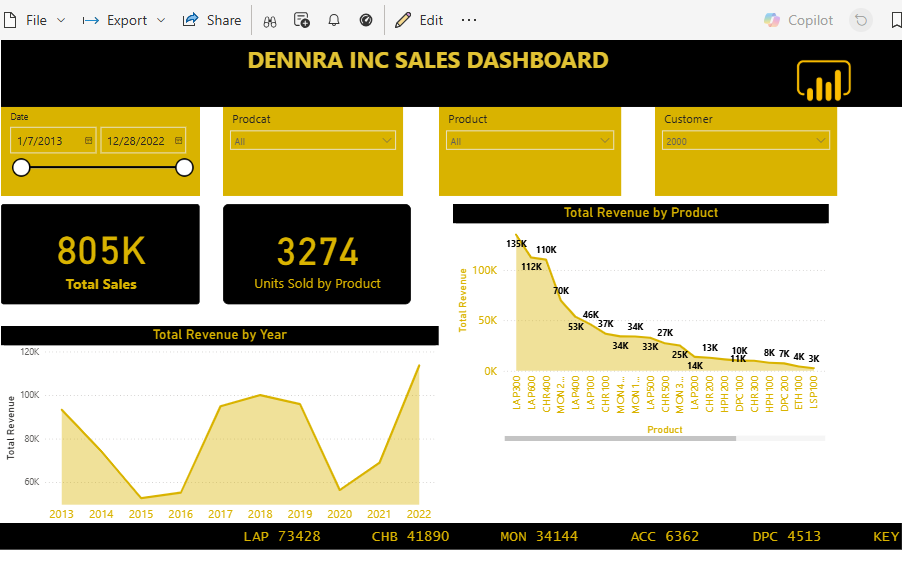
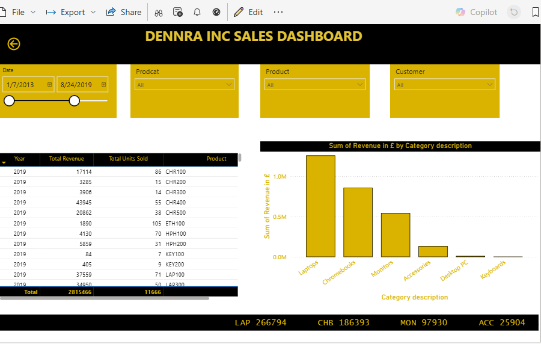
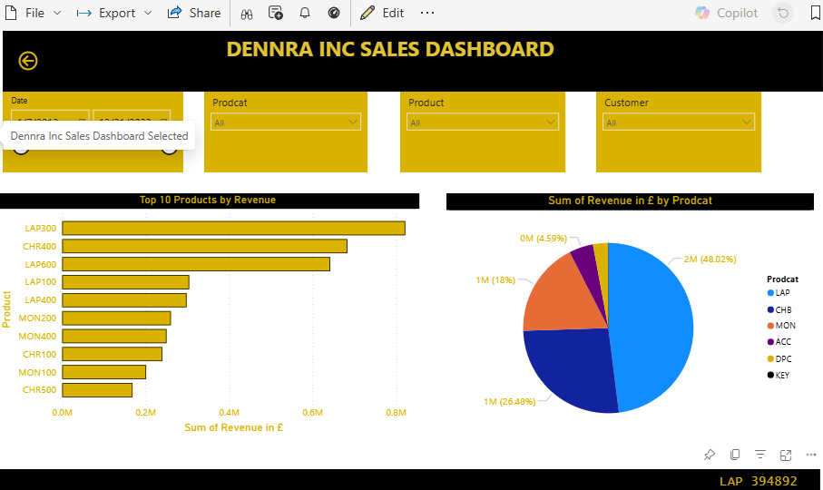
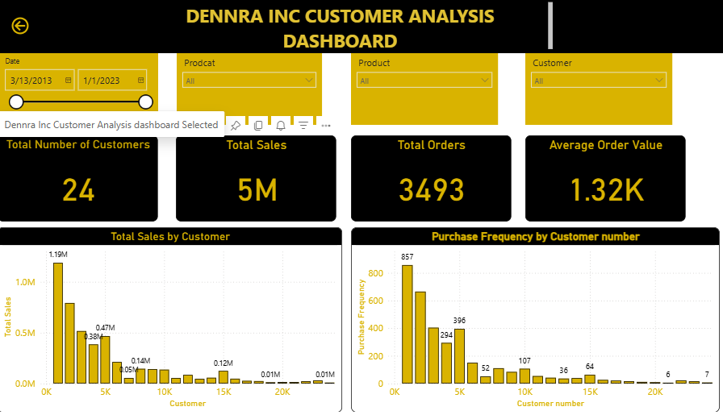
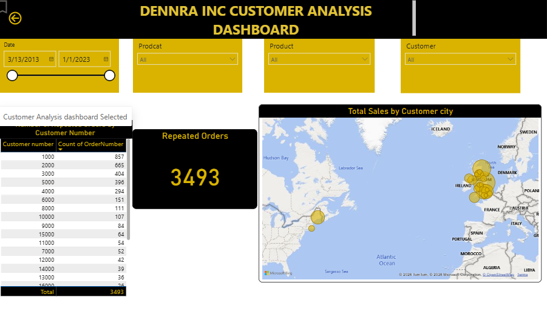
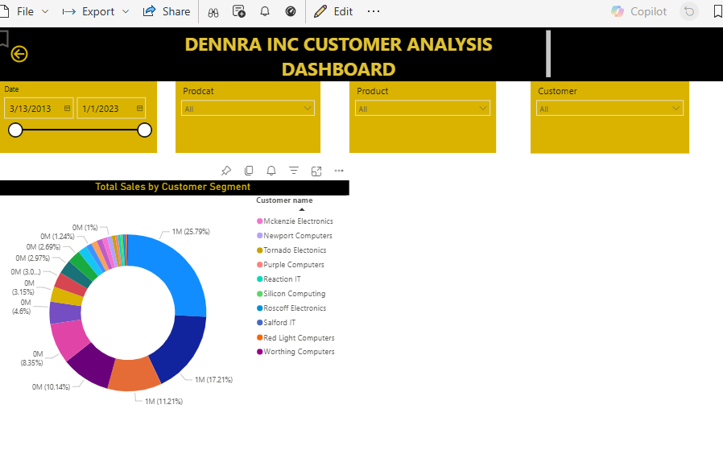

# Business Intelligence: Sales & Customer Analysis

## Overview

Comprehensive Business Intelligence implementation for **Dennra Inc.**, a UK-based ICT equipment provider, analyzing 9 years of sales data (2013-2022) to derive actionable insights for strategic decision-making. This project demonstrates the complete BI lifecycle from infrastructure planning through data acquisition, modeling, analysis, and strategic recommendations.

**Key Business Question:** How can Dennra Inc. leverage Business Intelligence to optimize sales performance, improve customer relationships, and gain competitive advantage in the ICT equipment market?

## 📊 Live Dashboard

**Power BI Interactive Report:** [View Full Analysis](https://app.powerbi.com/links/_1OtDy_ue_?ctid=1eb34f73-38dd-42db-98db-53b54e749d52&pbi_source=linkShare)

## Dashboard Overview

## Business Context

Dennra Inc. experienced substantial growth leading to massive data accumulation from operations. The company required a robust Business Intelligence framework using Power BI to transform this data into strategic insights driving informed decision-making and competitive positioning.

**Challenge:** Convert years of operational data into actionable intelligence for sales optimization and customer relationship enhancement.

**Solution:** Implement comprehensive BI system encompassing infrastructure planning, data integration, advanced analytics, and strategic recommendations.

## Dataset Overview

**Time Period:** 2013-2022 (9 years)  
**Data Sources:** Enterprise systems (ERP, CRM, inventory management)  

**Key Metrics:**
- **Total Revenue:** £5,000,000
- **Total Units Sold:** 19,000 units
- **Total Customers:** 24 active customers
- **Total Orders:** 3,563 transactions
- **Average Order Value:** £1,320 per customer

**Data Entities:**
- Sales transactions
- Customer records
- Product catalog
- Product categories
- Sales organizations
- Country/geographic data

## IT Infrastructure Analysis

### Infrastructure Requirements

A robust Business Intelligence environment requires carefully planned technological infrastructure. Key components identified:

#### 1. Data Sources Integration
**Requirement:** Centralized data collection from multiple systems
- Enterprise Resource Planning (ERP) systems
- Customer Relationship Management (CRM) platforms
- Inventory management systems
- Spreadsheets and databases
- Social media platforms

**Critical Success Factor:** Data quality through accuracy, reliability, and consistency

#### 2. Data Warehousing Solution
**Implementation:** Microsoft Azure Synapse Analytics
- Centralized repository for aggregated data
- SQL-based enterprise data warehousing
- Seamless Power BI integration
- Scalable cloud infrastructure

**Benefit:** Unified data access enabling comprehensive cross-functional analysis

#### 3. Hardware Infrastructure
**Minimum Requirements:**
- Operating System: Windows 10 Home or higher
- Processor: x64 processor, 1.4 GHz minimum
- Memory: 4GB RAM (recommended for Power BI Desktop)
- Storage: Scalable to accommodate exponential data growth

**Strategic Consideration:** Cloud-based infrastructure (Microsoft Azure) vs. on-premises deployment

#### 4. Network Connectivity
**Requirements:**
- High-speed, reliable dedicated network connection
- Sufficient bandwidth for real-time analytics
- Fast data transfer capabilities
- Multi-source data access optimization

#### 5. Data Governance Framework
**Implementation:** Policies and frameworks defining data management
- Data access controls and permissions
- Data quality standards
- Compliance requirements
- Security protocols

**Risk Mitigation:** Properly governed data prevents poor decision-making and missed opportunities

#### 6. Human Resources
**Requirement:** Business Intelligence specialists
- Drive data-driven strategy
- Facilitate informed decision-making
- Extract actionable insights
- Maintain competitive advantage

## Data Acquisition & Preparation

### Data Collection Process

**Collaboration Framework:**
- IT team coordination
- Data engineering partnerships
- Multi-system integration (ERP, CRM, inventory)

**Data Import to Power BI:**
1. Power BI Desktop installation and configuration
2. Excel workbook import functionality
3. Multi-table data loading
4. Initial data profiling

### Data Transformation & Cleansing

**Challenge:** Raw data contains inconsistencies from multiple sources requiring comprehensive cleaning.

**Power Query Editor Transformations:**

**1. Header Promotion:**
- First row promoted to column headers
- Standardized field naming conventions
- Consistent data structure across tables

**2. Data Quality Enhancement:**
- Duplicate entry removal
- Null value handling
- Missing data identification
- Anomaly detection and correction

**3. Data Type Standardization:**
- Numeric field validation
- Date format consistency
- Text field normalization

**Result:** Clean, reliable dataset ready for analysis and modeling

## Data Modeling & Relationships

### Entity Relationship Design

Robust table relationships form the foundation of effective Power BI data modeling, enabling seamless integration and cross-dimensional analysis.

**Data Model Structure:**

**Primary Entities:**
1. Sales (fact table)
2. Customer (dimension)
3. Product (dimension)
4. Product Category (dimension)
5. Sales Organization (dimension)
6. Country (dimension)

### Relationship Schema

| Primary Entity | Related Entity | Key Field | Relationship Type | Business Logic |
|----------------|----------------|-----------|-------------------|----------------|
| Sales | Customer | Customer Number | Many-to-One | Multiple orders per customer |
| Product | Product Category | Product Category Code | Many-to-One | Multiple products per category |
| Customer | Country | Country Code | One-to-One | Customer single country location |
| Customer | Sales Org | Sales Organization | Many-to-One | Customers across multiple regions |
| Sales | Product | Product ID | Many-to-One | Multiple products per order |

**Cardinality Principles:**
- **One-to-One:** Unique mapping (customer-country)
- **One-to-Many:** Parent-child hierarchy (category-products)
- **Many-to-One:** Aggregation relationships (orders-customer)

**Data Modeling Benefits:**
- High-performance analytics
- Accurate cross-dimensional analysis
- Efficient query execution
- Scalable solution architecture

## Sales Performance Analysis

### Key Findings

#### Revenue Performance

**Total Revenue: £5,000,000**
- 9-year cumulative sales
- **28.91% growth** over period
- Steady upward trajectory
- Significant 2015 dip (requires investigation)

**Revenue Trend:**
- Consistent year-over-year growth
- Demonstrates market demand sustainability
- Long-term business viability confirmed

#### Volume Analysis

**Total Units Sold: 19,000**
- Across all product categories
- 9-year sales volume
- Average 2,111 units per year

#### Top Performing Customer

**Customer: Aberdeen IT (Customer #1000)**
- **Revenue Generated:** £260,000
- **Units Purchased:** 933 units
- **Contribution:** 5.2% of total revenue
- **Status:** Key account requiring retention strategy

### Product Performance Analysis

#### Top 5 Products by Volume

**Product Rankings:**
1. **Laptops** - Highest volume, dominant category
2. **Chromebooks** - Strong second position
3. **Monitors** - Consistent performer
4. **Accessories** - High-volume, lower-value items
5. **Desktop PCs** - Stable enterprise demand

#### Product Category Revenue Distribution

**Laptops: 48.02% of Total Revenue**
- **Finding:** Nearly half of all revenue from single category
- **Implication:** Product concentration risk
- **Strategy:** Diversification opportunity while leveraging strength

**Category Performance:**
- Laptops: 48.02% (£2,401,000)
- Chromebooks: ~15% estimated
- Monitors: ~12% estimated
- Accessories: ~10% estimated
- Desktop PCs: ~9% estimated
- Keyboards: Lowest performer (<1%)

#### Underperforming Products

**Keyboards: Lowest Sales Volume**
- **Status:** Slow-moving inventory
- **Issue:** Potential overstock risk
- **Action Required:** Product elimination or repositioning strategy

### Strategic Sales Recommendations

#### 1. Product Bundling Strategy

**Objective:** Increase sales of slow-moving products

**Implementation:**
- Combine high-volume products (laptops) with low-volume items (keyboards)
- Offer bundled discounts
- Create "complete workstation" packages

**Expected Outcome:**
- Improved inventory turnover
- Differential pricing optimization
- Enhanced profit margins

**Research Support:** Bundling strategies improve profitability through price discrimination and increased perceived value

#### 2. Business Intelligence System Enhancement

**Current State:** Manual analysis, delayed insights  
**Proposed State:** Real-time BI dashboard with automated reporting

**Implementation:**
- Continuous performance monitoring
- Trend analysis capabilities
- Predictive analytics integration
- Automated alert systems

**Benefits:**
- Data-driven decision making
- Rapid response to market changes
- Competitive advantage maintenance

#### 3. Upselling & Cross-Selling Program

**Strategy:** Increase average order value per transaction

**Tactics:**
- **Upselling:** Recommend premium laptop models when customer selects mid-range
- **Cross-selling:** Suggest monitors, mice, keyboards with laptop purchases
- **Bundle offers:** "Complete IT setup" packages

**Expected Impact:**
- Higher transaction values
- Increased units per order
- Enhanced customer satisfaction

#### 4. Customer Relationship Management (CRM) Implementation

**Objective:** Leverage customer data for personalized engagement

**CRM Capabilities:**
- Customer purchase history analysis
- Buying pattern identification
- Personalized marketing campaigns
- Retention program management

**Strategic Value:**
- Deeper customer insights
- Improved retention rates
- Targeted sales strategies

#### 5. Digital Marketing Expansion

**Current Gap:** Limited online presence and reach  
**Opportunity:** Digital channel development

**Initiatives:**
- Search Engine Optimization (SEO)
- Content marketing strategy
- Social media presence
- Email marketing campaigns
- Pay-per-click advertising

**Expected Outcome:**
- Expanded customer base
- Geographic reach extension
- Brand awareness enhancement

## Customer Analysis

### Customer Base Overview

**Total Active Customers: 24**
- **Implication:** Concentrated customer base
- **Risk:** High customer dependency
- **Opportunity:** Aggressive acquisition strategy needed

**Total Orders: 3,563**
- Average 148.5 orders per customer
- High repeat purchase rate
- Strong customer loyalty indicators

**Average Order Value: £1,320**
- Premium transaction size
- B2B customer profile
- Enterprise sales focus

### Customer Segmentation Analysis

#### Most Valuable Customer (MVC)

**Customer: Artificial Brains (Customer #1000)**
- **Total Revenue:** £1,000,000 (20% of total revenue)
- **Order Frequency:** 865 orders (24.3% of all orders)
- **Revenue Share:** 25.79% of company revenue
- **Status:** Critical account - requires dedicated account management

**Risk Assessment:** Over-dependence on single customer representing 25.79% of revenue

#### Customer Concentration Analysis

**Top Customer Contribution: 25.79%**
- **Risk:** Single customer loss would significantly impact revenue
- **Mitigation:** Customer diversification strategy essential
- **Action:** Strengthen relationship while pursuing new customer acquisition

#### Least Engaged Customer

**Customer: Worthing Computers (Customer #21000)**
- **Order Frequency:** 6 orders (lowest)
- **Status:** At-risk customer
- **Action:** Re-engagement campaign required

### Purchase Behavior Patterns

**High-Frequency Characteristics:**
- Established business relationships
- Repeat purchasing patterns
- Bulk order tendencies
- Long-term partnership potential

**Low-Frequency Characteristics:**
- Occasional purchasers
- Project-based buying
- Price-sensitive behavior
- Retention risk factors

### Strategic Customer Recommendations

#### 1. Customer Loyalty Program Implementation

**Objective:** Reward, attract, and retain customers long-term

**Program Components:**
- **Points-Based Rewards:** Accumulate points for purchases
- **Tiered Benefits:** Bronze, Silver, Gold membership levels
- **Exclusive Discounts:** Member-only pricing
- **Early Access:** New product previews
- **Personalized Service:** Dedicated account managers

**Research Validation:** 62% of loyalty program members show increased spending on brands

**Expected Outcomes:**
- Enhanced customer retention (target: 90% retention rate)
- Increased customer lifetime value
- Competitive differentiation
- Reduced customer acquisition costs

#### 2. Customer Experience Research

**Methodology:**
- **Surveys:** Quarterly satisfaction assessments
- **Interviews:** Deep-dive customer feedback sessions
- **Focus Groups:** Product and service improvement insights

**Key Performance Indicators (KPIs):**
- **Customer Satisfaction Score (CSAT):** Target >85%
- **Net Promoter Score (NPS):** Measure recommendation likelihood
- **Customer Effort Score (CES):** Evaluate ease of doing business

**Action Items:**
- Identify service improvement opportunities
- Address pain points proactively
- Enhance customer touchpoint experiences

#### 3. Dynamic Pricing Strategy

**Objective:** Optimize pricing for revenue maximization

**Tactics:**
- **Seasonal Promotions:** Boost slow-moving product sales
- **Volume Discounts:** Encourage larger orders
- **Customer-Specific Pricing:** Reward loyalty
- **Product Bundle Pricing:** Increase basket size

**Implementation:**
- Real-time market monitoring
- Competitor price tracking
- Demand-based adjustments
- Customer segment targeting

**Expected Impact:**
- Revenue growth
- Inventory optimization
- Market responsiveness

#### 4. Referral Program Development

**Objective:** Leverage existing customers for new customer acquisition

**Program Structure:**
- **Referrer Incentive:** 10% discount on next purchase
- **Referee Benefit:** 5% discount on first order
- **Milestone Bonuses:** Additional rewards for multiple referrals

**Marketing Channel Performance:** Referrals generate highest conversion rates among acquisition channels

**Expected Results:**
- Cost-effective customer acquisition
- High-quality lead generation
- Customer engagement enhancement
- Organic growth acceleration

#### 5. Continuous Dashboard Monitoring

**Implementation:**
- Real-time customer analytics dashboard
- Automated alert systems for customer behavior changes
- Trend analysis and pattern recognition
- Predictive churn modeling

**Data Integration:**
- CRM system connectivity
- Sales transaction feeds
- Customer service interactions
- Market trend indicators

**Strategic Value:**
- Proactive customer management
- Data-driven decision making
- Early risk identification
- Opportunity spotting

## Technical Skills Demonstrated

### Business Intelligence Expertise
- **Full BI Lifecycle Management:** Infrastructure planning through deployment and optimization
- **Data Warehousing:** Azure Synapse Analytics integration and configuration
- **ETL Process Design:** Extract, Transform, Load workflow optimization
- **Data Governance:** Policy framework development and implementation

### Data Management & Modeling
- **Relational Database Design:** Entity-relationship modeling with proper cardinality
- **Data Quality Management:** Cleansing, validation, and standardization
- **Power Query Mastery:** Advanced data transformation techniques
- **Dimensional Modeling:** Star schema implementation

### Analytics & Visualization
- **Power BI Advanced Features:** DAX calculations, complex visualizations, drill-down capabilities
- **KPI Development:** Performance metric definition and tracking
- **Dashboard Design:** Executive-level reporting and interactive analytics
- **Correlation Analysis:** Multi-dimensional relationship identification

### Business Strategy
- **Strategic Analysis:** Sales and customer performance evaluation
- **Recommendation Development:** Actionable, data-driven business strategies
- **ROI Calculation:** Business case development and value quantification
- **Stakeholder Communication:** Technical-to-business translation

### IT Infrastructure
- **System Architecture:** Hardware and network requirement specification
- **Cloud Solutions:** Azure platform understanding and implementation
- **Integration Planning:** Multi-system connectivity design
- **Scalability Assessment:** Growth-oriented infrastructure planning

## Dashboard Features

### Interactive Capabilities

**Sales Analysis View:**
- Revenue trend analysis (9-year timeline)
- Product category breakdown
- Customer performance ranking
- Geographic distribution mapping

**Customer Analysis View:**
- Order frequency tracking
- Customer lifetime value calculation
- Purchase pattern identification
- Segmentation analysis

**Product Performance View:**
- Category contribution analysis
- Volume vs. revenue comparison
- Slow-moving inventory identification
- Best-seller tracking

### Advanced Functionality
- **Drill-Down:** Multi-level data exploration
- **Filtering:** Dynamic data slicing by multiple dimensions
- **Cross-Highlighting:** Interactive visual relationships
- **Time Intelligence:** Year-over-year comparisons

## Business Impact & Expected Outcomes

### Sales Optimization

**Current Performance:** £5M revenue baseline  
**Growth Trajectory:** 28.91% over 9 years  
**Optimization Potential:** 15-20% revenue increase through strategic initiatives

**Key Drivers:**
- Product bundling implementation
- Upselling/cross-selling programs
- Digital marketing expansion
- Inventory optimization

### Customer Relationship Enhancement

**Current State:** 24 active customers  
**Target State:** 30+ customers with improved retention

**Strategies:**
- Loyalty program (90% retention target)
- Referral program (5-10 new customers annually)
- CRM implementation (personalized engagement)
- Experience improvement (CSAT >85%)

### Operational Efficiency

**Data-Driven Culture:**
- Real-time decision making
- Predictive analytics capability
- Proactive issue identification
- Continuous optimization

## Key Takeaways & Lessons Learned

### Critical Success Factors

1. **Infrastructure Foundation:** Proper IT infrastructure is essential for sustainable BI success

2. **Data Quality Priority:** Clean, reliable data is prerequisite for accurate insights

3. **Relationship Modeling:** Proper entity relationships enable comprehensive cross-dimensional analysis

4. **Business Focus:** Analytics must drive actionable business recommendations

5. **Customer Concentration Risk:** 25.79% revenue from single customer requires diversification

6. **Product Focus:** 48% revenue concentration in laptops presents both strength and risk

7. **Small Customer Base:** 24 customers necessitates aggressive acquisition strategy

8. **Loyalty Program Necessity:** High customer retention critical with concentrated base

### Strategic Imperatives

**Immediate Actions (0-3 months):**
- Implement customer loyalty program
- Launch product bundling strategy
- Establish referral program framework

**Short-Term Initiatives (3-6 months):**
- CRM system implementation
- Digital marketing campaign launch
- Dynamic pricing strategy deployment

**Long-Term Strategies (6-12 months):**
- Customer base expansion (target: 35+ customers)
- Product portfolio diversification
- Predictive analytics integration

## Limitations & Future Enhancements

### Current Limitations

**Data Scope:**
- Historical data only (2013-2022)
- No real-time data feeds
- Limited external market data integration
- Single company analysis (no competitor benchmarking)

**Analysis Constraints:**
- Product-level profitability not calculated
- Marketing attribution not tracked
- Seasonal pattern analysis limited
- Customer acquisition costs not included

### Future Enhancement Roadmap

#### Phase 1: Data Expansion
- **Real-Time Integration:** Live sales data feeds
- **External Data Sources:** Market trends, competitor intelligence
- **Profitability Analysis:** Product and customer margin calculations
- **Marketing Attribution:** Campaign effectiveness tracking

#### Phase 2: Advanced Analytics
- **Predictive Modeling:** Sales forecasting using machine learning
- **Customer Churn Prediction:** At-risk customer identification
- **Demand Forecasting:** Inventory optimization algorithms
- **Price Optimization:** AI-driven dynamic pricing

#### Phase 3: Strategic Intelligence
- **Competitive Analysis:** Market positioning dashboard
- **Market Basket Analysis:** Product affinity modeling
- **Customer Lifetime Value:** Predictive CLV calculation
- **Scenario Planning:** What-if analysis capabilities

#### Phase 4: Automation
- **Automated Reporting:** Scheduled dashboard delivery
- **Alert Systems:** Threshold-based notifications
- **Recommendation Engine:** AI-powered next-best-action suggestions
- **Natural Language Query:** Conversational analytics interface

## Methodology

### Analysis Framework

**1. Infrastructure Assessment**
- IT requirements analysis
- System architecture design
- Scalability planning
- Governance framework establishment

**2. Data Acquisition**
- Multi-source integration
- ETL process design
- Data quality validation
- Storage optimization

**3. Data Preparation**
- Power Query transformations
- Duplicate removal
- Null handling
- Data type standardization

**4. Data Modeling**
- Entity relationship design
- Cardinality definition
- Key identification
- Relationship validation

**5. Analysis & Insights**
- Sales performance evaluation
- Customer behavior analysis
- Product performance assessment
- Trend identification

**6. Strategic Recommendations**
- Actionable strategy development
- Implementation roadmap creation
- KPI definition
- Success metric establishment

### Tools & Technologies

**Primary Platform:** Microsoft Power BI Desktop  
**Data Warehousing:** Microsoft Azure Synapse Analytics  
**Data Sources:** Excel workbooks (enterprise system exports)  
**Modeling:** Power Query Editor, DAX  
**Visualization:** Power BI interactive dashboards

## Conclusion

This comprehensive Business Intelligence implementation for Dennra Inc. demonstrates the transformative power of data-driven decision making. Key achievements include:

**Business Insights:**
- £5M revenue analysis revealing 28.91% growth trajectory
- Identification of critical customer (25.79% revenue concentration)
- Product category optimization opportunities (laptops 48% of revenue)
- Strategic customer base expansion needs (24 customers insufficient)

**Technical Excellence:**
- Complete BI infrastructure planning and implementation
- Robust data modeling with proper relational design
- Advanced Power BI dashboard with interactive capabilities
- Comprehensive ETL and data quality management

**Strategic Impact:**
- Actionable recommendations for revenue optimization
- Customer retention and acquisition strategies
- Product portfolio optimization guidance
- Foundation for data-driven organizational culture

By implementing these recommendations and continuously refining the BI strategy, Dennra Inc. can achieve sustained competitive advantage, enhanced profitability, and deeper customer relationships in the competitive ICT equipment market.

The project demonstrates that successful Business Intelligence extends beyond technical implementation—it requires strategic thinking, business acumen, and commitment to continuous improvement through data-driven insights.

## Author

**Laura Mumbua**  
Master's in Business Analytics & Data Science | EU Business School Munich  
5+ years IT Infrastructure Experience | Transitioning to Data Analytics

📧 Email: laura.mumbua@gmail.com  
💼 LinkedIn: [linkedin.com/in/laura-mumbua](https://linkedin.com/in/laura-mumbua)  

*This project was completed as part of MADSC301 - Business Intelligence course at EU Business School Munich, demonstrating proficiency in BI infrastructure planning, Power BI advanced features, data modeling, strategic analysis, and business recommendations.*

**Skills Showcased:** Power BI | Business Intelligence | Data Modeling | ETL | IT Infrastructure | Strategic Analysis | Customer Analytics | Sales Optimization
